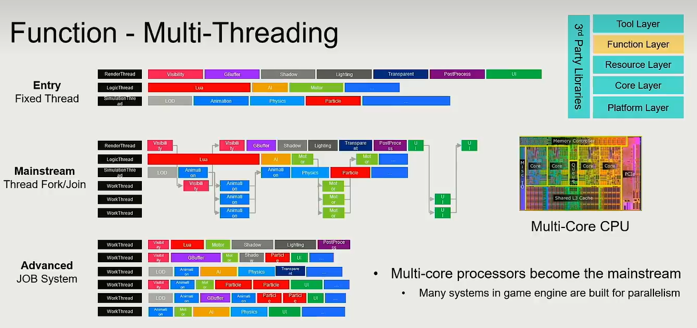
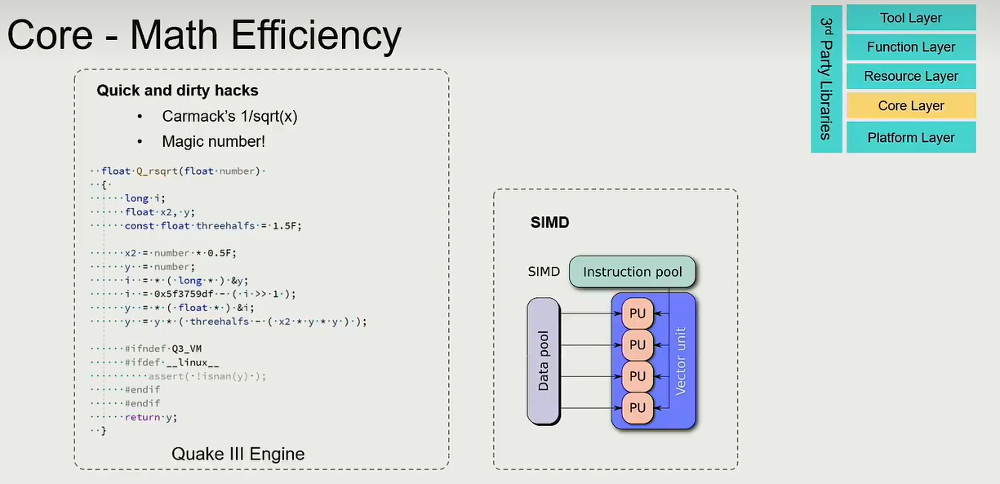

# Lec1 游戏引擎导论

**What's game engine?**
::point_right:Technology foundation of Matrix (黑客帝国)
::point_right:Productivity tools of creation
::point_right:Art of complexity

**引擎开发的难点：**
Realtime
Toolchain for creators
Developer platform
Update the engine on the fly

# Lec2 引擎架构分层

## Tool layer 

即编辑器，以及将DCC(Digital content creation)导入游戏引擎中的Asset Conditioning Pipeline

## Function layer

tick，优先创建游戏世界，再创建观察者视角（渲染）

## Resource layer

将外部的资源转换成引擎的高效资源Asset，用于管理游戏中所有资产的生命周期（垃圾回收、延时加载技术）

## Core layer

运算效率十分重要（如SMID） ，另外还负责Memory Management，以尽可能减少内存碎片

## Platform layer

用于在不同平台上发布时，开发者能尽可能忽视平台的区别

## 3rd party libraries

第三方代码库，如一些物理引擎等

## 题外话：内存管理的三条要点

:one:把数据放到一起管理

:two:访问数据时尽可能顺序访问

:three:数据处理时尽可能批量处理

# Lec3 如何构建游戏世界

我们可以将任意一个Game Object分为两部分，即Property和Behaviour

:one: Everything is a game object in the game world.

:two: Game object could be described in the component-based way.

game object之间通过event来传递信息

为了保证消息传递的时序正确性，我们需要用“邮局”管理投递顺序，保证一致性