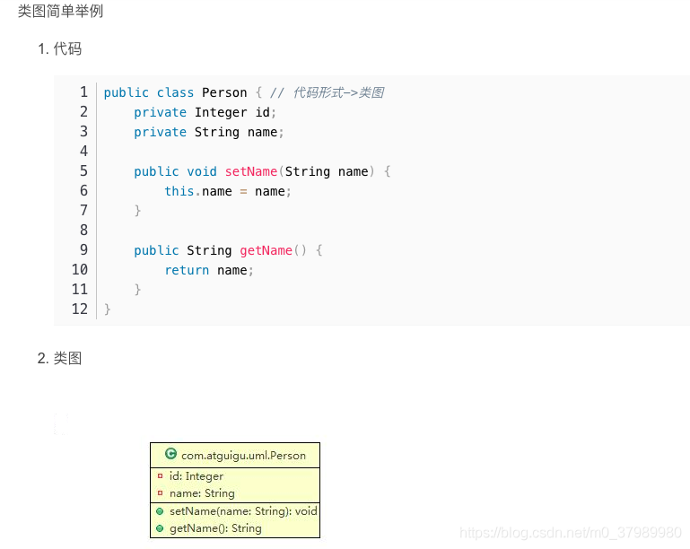
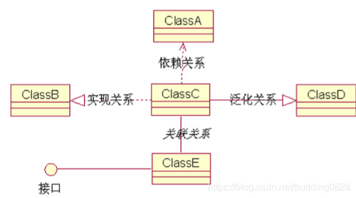
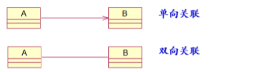
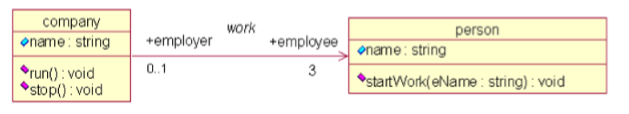
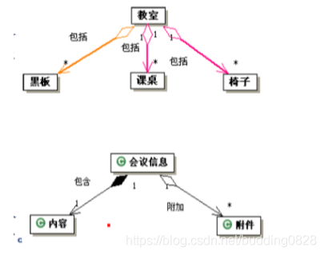

## 类图

- 类图的概念：类图是描述类、接口以及它们之间关系的图，它显示了系统中各个类的静态结构，是一种静态模型。
- 分类可以有效地使复杂问题简化。建立类模型的过程，是把现实世界中与问题有关的各种对象及其相互关系进行抽象和分类的过程。

- 对象：是人们对某个事物的一种抽象描述。对象的基本特征可以归纳为对象的属性和行为两类。
- 类：类是指对一组具有相同特征的对象的抽象描述；任何对象都是某个类的实例。

### 关联关系

类与类之间的连接，使使一个类知道另一个类的属性和方法（实例变量体现）。A类依赖于B对象,并且把B作为A的一个成员变量，则A和B存在关联关系.

1. 概念：关联用来表示来表示两个（或多个）类的对象之间的结构关系，它在代码中表现为一个类以属性的形式包含对另一个类的一个或多个对象的引用。指一个类中包含另一个类的实例。

2. 表示：用一条无向线段表示，是一种双向关系。例如客户和订单的关联：从客户看，订单是他提交的；从订单看，它有一个客户。用一条有向线段表示，是一种单向关系。

3. 名称：关联的名称表达了关联的内容，一般使用动宾结构短语。关联的名称仅有语义作用，不转换为代码

4. 可见性：用可见性修饰角色名称，以说明该角色名称可以在哪些范围内被访问。

### 泛化关系

1. 概念：泛化关系(继承关系)定义类和包之间的一般元素和特殊元素之间的分类关系。泛化也称之为继承或派生。
   
2. 区别：
   泛化(Generalization): 抽象化
   特化(Specialization): 实例化

### 依赖关系

1. 概念：依赖表示一个类以某种形式依赖于其他类。当两个类处于依赖关系中时，其中一个类的改变可能会影响另一个类。
2. 在程序代码中，依赖关系意味着一个类的对象出现在另一个类的操作当中。常见的有两种情况：一个类将另一个类的对象作为自己某个操作的参数（形参），或者是操作的局部变量。

相比关联关系，依赖关系的两个类之间的联系更弱。

### 实现关系

指一个class类实现interface接口的功能；实现是类与接口之间最常见的联系

### 聚合和组合

聚合：
	聚合表示类之间的整体与部分的关系。聚合意味着一个类拥有但共享另一个类的对象。
	当整体类不存在时，部分类仍可能存在。部分类被销毁时，整体类也将能够存在。

组合：
	组合是一种特殊形式的聚合。与聚合相比，它有两个特点：
	一个部分类最多只能属于一个整体类
	当整体类不存在时，部分类将同时被销毁。

关联关系的两个类的层次相同，而聚合关系中的两个关系不在同一层面上。

聚合也是表示类和类之间的“整体－部分”关系，用空心菱形表示。
组合是聚合的一种特殊情形，用实心菱形表示

### 类图的宗旨：怎么看得懂怎么来