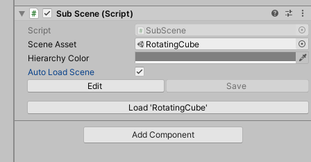

# Unity Dots初见

## Installation and Setup

### Unity Editor version

2020.3.30+ or 2021.3.4+ with entities version: 0.51

### IDE support

Entities uses the [Microsoft Source Generator](https://docs.microsoft.com/en-us/dotnet/csharp/roslyn-sdk/source-generators-overview) feature for its code generation, which means it needs a high ide version.

Visual Studio 2022+

Rider 2021.3.3+

### Package installation

The Entities package isn't listed in the Package Manager, even if you've enabled the `Preview Packages` setting. You can use the following ways to install the Entities package:

1. Use `Add package from git URL` under the `+` menu at the top left of the package manager to add packages either by name (such as  `com.unity.entities`) or by Git URL (but this option isn't available for DOTS packages). If you want to use a Git URL instead of just a name in the Package Manager, you must have the git command line tools installed.
2. Directly edit the `Packages\manifest.json` file in the Unity project. 

```
com.unity.entities
com.unity.collections
com.unity.jobs
com.unity.hybrid.renderer
```


## 0.51版本官方案例笔记

### HelloCube / 1. ForEach

创建第一个Dots程序

步骤：

1. 创建subscene
2. 在subscene下创建子物体
3. 编写脚本`RotationSpeed_ForEach`挂在子物体上
4. 编写脚本`RotationSpeedSystem_ForEach`用于控制组件的变化

```c#
using System;
using Unity.Entities;

// Unity看到[GenerateAuthoringComponent]，就会帮我们自动生成一个MonoBehaviour的class
// 包含继承的IComponent的struct定义的public字段，和一个转换函数
// 所以这个脚本是可以直接在Unity编辑器中拖到GameObject上的
[GenerateAuthoringComponent]	
public struct RotationSpeed_ForEach : IComponentData
{
    public float RadiansPerSecond;
}
```

```c#
using Unity.Entities;
using Unity.Jobs;
using Unity.Mathematics;
using Unity.Transforms;

// This system updates all entities in the scene with both a RotationSpeed_ForEach and Rotation component.

// ReSharper disable once InconsistentNaming
public partial class RotationSpeedSystem_ForEach : SystemBase
{
    // OnUpdate runs on the main thread.
    // 类似于MonoBehavior的Update，每一帧调用
    protected override void OnUpdate()
    {
        float deltaTime = Time.DeltaTime;

        // Schedule job to rotate around up vector
        Entities
            .WithName("RotationSpeedSystem_ForEach")
            // 这个Rotation也是Dots内置的继承于IComponentData的组件，类似于Transform的Rotation
            .ForEach((ref Rotation rotation, in RotationSpeed_ForEach rotationSpeed) =>
            {
                // math.mul是Dots的数学库，支持SIMD，性能大幅提升
                rotation.Value = math.mul(
                    math.normalize(rotation.Value),
                    quaternion.AxisAngle(math.up(), rotationSpeed.RadiansPerSecond * deltaTime));
            })
            .ScheduleParallel();
    }
}
```

### HelloCube / 2. IJobChunk

手写authoring component

步骤：

1. 编写组件脚本`RotationSpeed_IJobEntityBatch`
2. 编写Entities转换脚本`RotationSpeedAuthoring_IJobEntityBatch`挂载在目标对象上
3. 编写脚本`RotationSpeedSystem_IJobChunk`控制组件变化

```c#
using System;
using Unity.Entities;

// ReSharper disable once InconsistentNaming
[Serializable]
public struct RotationSpeed_IJobEntityBatch : IComponentData
{
    public float RadiansPerSecond;
}
```

```c#
using Unity.Entities;
using Unity.Mathematics;
using UnityEngine;

// ReSharper disable once InconsistentNaming
[AddComponentMenu("DOTS Samples/IJobEntityBatch/Rotation Speed")]
[ConverterVersion("joe", 1)]
public class RotationSpeedAuthoring_IJobEntityBatch : MonoBehaviour, IConvertGameObjectToEntity
{
    public float DegreesPerSecond = 360.0F;

    // The MonoBehaviour data is converted to ComponentData on the entity.
    // We are specifically transforming from a good editor representation of the data (Represented in degrees)
    // To a good runtime representation (Represented in radians)
    public void Convert(Entity entity, EntityManager dstManager, GameObjectConversionSystem conversionSystem)
    {
        var data = new RotationSpeed_IJobEntityBatch { RadiansPerSecond = math.radians(DegreesPerSecond) };
        dstManager.AddComponentData(entity, data);
    }
}
```

```c#
using Unity.Burst;
using Unity.Collections;
using Unity.Entities;
using Unity.Jobs;
using Unity.Mathematics;
using Unity.Transforms;

// This system updates all entities in the scene with both a RotationSpeed_IJobChunk and Rotation component.

// ReSharper disable once InconsistentNaming
// 这里实现了IJobChunk
// 用IJobChunk能适应更复杂的情况，拥有更好的性能
public partial class RotationSpeedSystem_IJobChunk : SystemBase
{
    EntityQuery m_Query;

    // 要在System里用IJobChunk需要重载OnCreate函数
    // 然后用EntityQuery的成员变量把需要的Component先存起来
    protected override void OnCreate()
    {
        // Cached access to a set of ComponentData based on a specific query
        // 用于找所有拥有Rotation和RotationSpeed_IJobEntityBatch组件的Entities
        // 其中RotationSpeed_IJobEntityBatch组件只读
        m_Query = GetEntityQuery(typeof(Rotation), ComponentType.ReadOnly<RotationSpeed_IJobEntityBatch>());
    }

    // Use the [BurstCompile] attribute to compile a job with Burst. You may see significant speed ups, so try it!
    [BurstCompile]
    struct RotationSpeedJob : IJobEntityBatch
    {
        public float DeltaTime;
        // handle，句柄，即唯一标识符
        public ComponentTypeHandle<Rotation> RotationTypeHandle;
        [ReadOnly] public ComponentTypeHandle<RotationSpeed_IJobEntityBatch> RotationSpeedTypeHandle;
		
        // 具体要做什么样的操作
        public void Execute(ArchetypeChunk batchInChunk, int batchIndex)
        {
            // 根据句柄获取数组
            var chunkRotations = batchInChunk.GetNativeArray(RotationTypeHandle);
            var chunkRotationSpeeds = batchInChunk.GetNativeArray(RotationSpeedTypeHandle);
            for (var i = 0; i < batchInChunk.Count; i++)
            {
                var rotation = chunkRotations[i];
                var rotationSpeed = chunkRotationSpeeds[i];

                // Rotate something about its up vector at the speed given by RotationSpeed_IJobChunk.
                chunkRotations[i] = new Rotation
                {
                    Value = math.mul(math.normalize(rotation.Value),
                        quaternion.AxisAngle(math.up(), rotationSpeed.RadiansPerSecond * DeltaTime))
                };
            }
        }
    }

    // OnUpdate runs on the main thread.
    protected override void OnUpdate()
    {
        // Explicitly declare:
        // - Read-Write access to Rotation
        // - Read-Only access to RotationSpeed_IJobChunk
        var rotationType = GetComponentTypeHandle<Rotation>();
        // 参数为true，表示只读
        var rotationSpeedType = GetComponentTypeHandle<RotationSpeed_IJobEntityBatch>(true);
        // 在上一个示例中，job以lambda表达式形式出现
        var job = new RotationSpeedJob()
        {
            RotationTypeHandle = rotationType,
            RotationSpeedTypeHandle = rotationSpeedType,
            DeltaTime = Time.DeltaTime
        };

        Dependency = job.ScheduleParallel(m_Query, Dependency);
    }
}
```

### HelloCube / 3. SubScene

在一个大场景中可以有多个子场景，这是为了实现分块加载，以达到不同的时间加载不同物体的目的。

对于子场景，保存时会DOTS化（native, binary format）。加载它时，能将它的数据最小化到RAM中。这个RAM应该是cpu的cache。我理解是重新组织了Scene的数据，让其适应DOTS。这些都是内置脚本SubScene.cs实现的。

文档中提到，子场景可以运行时自动加载，也可以用`RequestSceneLoaded`延迟加载。

inspector面板上有一个“Auto Load Scene”选项的。如果不勾选这个，运行时，子场景是不会加载的。



### HelloCube / 4.SpawnFromMonoBehaviour

Entities生成器

步骤：

1. 创建Prefab，并在它身上挂上Entities组件
2. 创建`Spawner_FromMonoBehaviour`脚本用于生成

```c#
using Unity.Entities;
using Unity.Mathematics;
using Unity.Transforms;
using UnityEngine;

// ReSharper disable once InconsistentNaming
[AddComponentMenu("DOTS Samples/SpawnFromMonoBehaviour/Spawner")]
public class Spawner_FromMonoBehaviour : MonoBehaviour
{
    // Prefab上应该要挂载做什么的脚本
    public GameObject Prefab;
    public int CountX = 100;
    public int CountY = 100;

    void Start()
    {
        // Create entity prefab from the game object hierarchy once
        var settings = GameObjectConversionSettings.FromWorld(World.DefaultGameObjectInjectionWorld, null);
        // 根据设置把GameObject转换成Entity
        var prefab = GameObjectConversionUtility.ConvertGameObjectHierarchy(Prefab, settings);
        var entityManager = World.DefaultGameObjectInjectionWorld.EntityManager;

        for (var x = 0; x < CountX; x++)
        {
            for (var y = 0; y < CountY; y++)
            {
                // Efficiently instantiate a bunch of entities from the already converted entity prefab
                var instance = entityManager.Instantiate(prefab);

                // Place the instantiated entity in a grid with some noise
                // noise.cnoise是Dots数学库自带的柏林噪声
                var position = transform.TransformPoint(new float3(x * 1.3F, noise.cnoise(new float2(x, y) * 0.21F) * 2, y * 1.3F));
                // 修改Component数据
                entityManager.SetComponentData(instance, new Translation {Value = position});
            }
        }
    }
}
```
